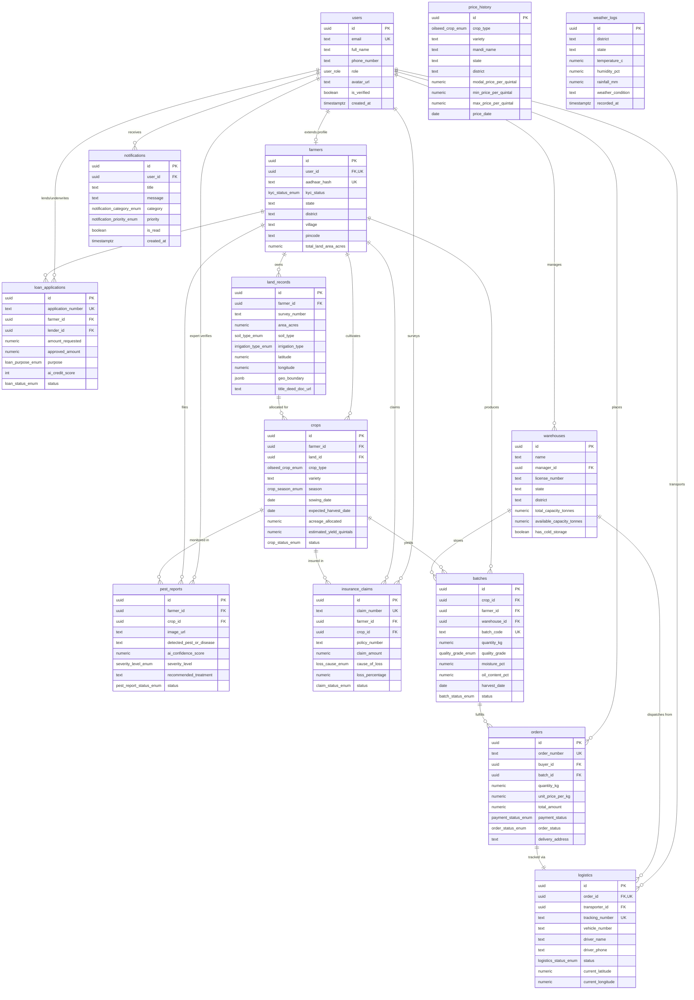

# Entity Relationship Diagram (ERD)

## Project: AI-Enabled Value Chain Platform for Oilseed Self-Reliance
**Database:** PostgreSQL / Supabase (14 Core Tables)

```mermaid
erDiagram
    users ||--o| farmers : "extends profile"
    users ||--o{ orders : "places"
    users ||--o{ warehouses : "manages"
    users ||--o{ logistics : "transports"
    users ||--o{ notifications : "receives"
    users ||--o{ pest_reports : "expert verifies"
    users ||--o{ loan_applications : "lends/underwrites"
    users ||--o{ insurance_claims : "surveys"

    farmers ||--o{ land_records : "owns"
    farmers ||--o{ crops : "cultivates"
    farmers ||--o{ batches : "produces"
    farmers ||--o{ pest_reports : "files"
    farmers ||--o{ loan_applications : "applies"
    farmers ||--o{ insurance_claims : "claims"

    land_records ||--o{ crops : "allocated for"
    crops ||--o{ batches : "yields"
    crops ||--o{ pest_reports : "monitored in"
    crops ||--o{ insurance_claims : "insured in"

    warehouses ||--o{ batches : "stores"
    warehouses ||--o{ logistics : "dispatches from"

    batches ||--o{ orders : "fulfills"
    orders ||--|| logistics : "tracked via"

    users {
        uuid id PK
        text email UK
        text full_name
        text phone_number
        user_role role
        text avatar_url
        boolean is_verified
        timestamptz created_at
    }

    farmers {
        uuid id PK
        uuid user_id FK,UK
        text aadhaar_hash UK
        kyc_status_enum kyc_status
        text state
        text district
        text village
        text pincode
        numeric total_land_area_acres
    }

    land_records {
        uuid id PK
        uuid farmer_id FK
        text survey_number
        numeric area_acres
        soil_type_enum soil_type
        irrigation_type_enum irrigation_type
        numeric latitude
        numeric longitude
        jsonb geo_boundary
        text title_deed_doc_url
    }

    crops {
        uuid id PK
        uuid farmer_id FK
        uuid land_id FK
        oilseed_crop_enum crop_type
        text variety
        crop_season_enum season
        date sowing_date
        date expected_harvest_date
        numeric acreage_allocated
        numeric estimated_yield_quintals
        crop_status_enum status
    }

    batches {
        uuid id PK
        uuid crop_id FK
        uuid farmer_id FK
        uuid warehouse_id FK
        text batch_code UK
        numeric quantity_kg
        quality_grade_enum quality_grade
        numeric moisture_pct
        numeric oil_content_pct
        date harvest_date
        batch_status_enum status
    }

    orders {
        uuid id PK
        text order_number UK
        uuid buyer_id FK
        uuid batch_id FK
        numeric quantity_kg
        numeric unit_price_per_kg
        numeric total_amount
        payment_status_enum payment_status
        order_status_enum order_status
        text delivery_address
    }

    warehouses {
        uuid id PK
        text name
        uuid manager_id FK
        text license_number
        text state
        text district
        numeric total_capacity_tonnes
        numeric available_capacity_tonnes
        boolean has_cold_storage
    }

    logistics {
        uuid id PK
        uuid order_id FK,UK
        uuid transporter_id FK
        text tracking_number UK
        text vehicle_number
        text driver_name
        text driver_phone
        logistics_status_enum status
        numeric current_latitude
        numeric current_longitude
    }

    price_history {
        uuid id PK
        oilseed_crop_enum crop_type
        text variety
        text mandi_name
        text state
        text district
        numeric modal_price_per_quintal
        numeric min_price_per_quintal
        numeric max_price_per_quintal
        date price_date
    }

    weather_logs {
        uuid id PK
        text district
        text state
        numeric temperature_c
        numeric humidity_pct
        numeric rainfall_mm
        text weather_condition
        timestamptz recorded_at
    }

    pest_reports {
        uuid id PK
        uuid farmer_id FK
        uuid crop_id FK
        text image_url
        text detected_pest_or_disease
        numeric ai_confidence_score
        severity_level_enum severity_level
        text recommended_treatment
        pest_report_status_enum status
    }

    loan_applications {
        uuid id PK
        text application_number UK
        uuid farmer_id FK
        uuid lender_id FK
        numeric amount_requested
        numeric approved_amount
        loan_purpose_enum purpose
        int ai_credit_score
        loan_status_enum status
    }

    insurance_claims {
        uuid id PK
        text claim_number UK
        uuid farmer_id FK
        uuid crop_id FK
        text policy_number
        numeric claim_amount
        loss_cause_enum cause_of_loss
        numeric loss_percentage
        claim_status_enum status
    }

    notifications {
        uuid id PK
        uuid user_id FK
        text title
        text message
        notification_category_enum category
        notification_priority_enum priority
        boolean is_read
        timestamptz created_at
    }
```
